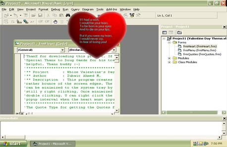



## Whize VALENTINE's DAY THEME

### Description

Valentine's Day will be here soon. This is my way of spreading love. Presenting Whize VALENTINE'S DAY THEME. This program creates a heart shaped form and let it floats or rather bounce of the screen edges. The heart also displays a love quote. The heart'can be minimized to the system tray by left clicking on it and can be made to stand still y right clicking. Once minimized the system tray, it can be restored by double clicking. U can right click the form when minimzed for options.U can set the popup interval when the heart must popup again. The program is ez to understand.

Special thanx to Doug Gaede for his transparent shape class. It was very helpful. Thanx buddy :-)
 
### More Info
 

             |
---                |---
**Submitted On**   |2003-01-31 21:00:06
**By**             |[Dark Force](https://github.com/Planet-Source-Code/PSCIndex/blob/master/ByAuthor/dark-force.md)
**Level**          |Intermediate
**User Rating**    |3.8 (23 globes from 6 users)
**Compatibility**  |VB 6\.0
**Category**       |[Custom Controls/ Forms/  Menus](https://github.com/Planet-Source-Code/PSCIndex/blob/master/ByCategory/custom-controls-forms-menus__1-4.md)
**World**          |[Visual Basic](https://github.com/Planet-Source-Code/PSCIndex/blob/master/ByWorld/visual-basic.md)
**Archive File**   |[Whize\_VALE153773212003\.zip](https://github.com/Planet-Source-Code/dark-force-whize-valentine-s-day-theme__1-42867/archive/master.zip)

